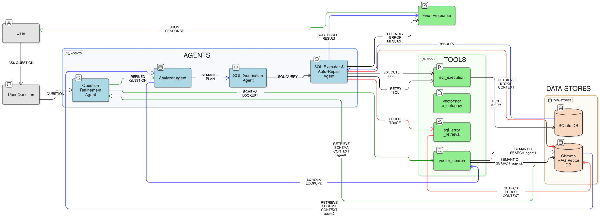
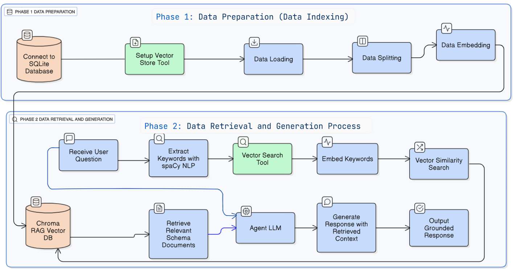
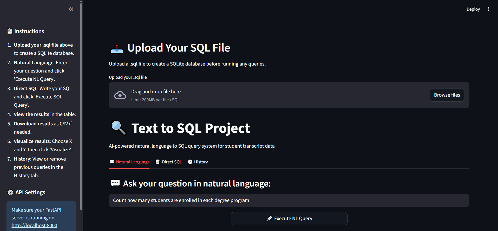

# CrewToSQL: RAG-Driven Multi-Agent Framework for Self-Correcting Text-to-SQL Generation

**A Comprehensive Approach to Natural Language Database Querying**

[](https://python.org)
[](https://fastapi.tiangolo.com/)
[](https://streamlit.io/)
[](LICENSE)

##  Overview

CrewToSQL is an innovative multi-agent text-to-SQL system that leverages Retrieval-Augmented Generation (RAG) and auto-repair capabilities to transform natural language queries into accurate SQL statements. The system achieves **89.7% execution accuracy**, representing a **34.6 percentage point improvement** over baseline systems.

### Key Features

- ** Multi-Agent Architecture**: 4 specialized agents working collaboratively
- ** Auto-Repair Capabilities**: Self-correcting SQL generation with iterative refinement
- ** RAG Integration**: Context-aware database understanding using ChromaDB
- ** High Accuracy**: Perfect accuracy (100%) on medium and hard complexity queries
- ** Modern Web Interface**: FastAPI backend with Streamlit frontend
- ** Rich Visualizations**: Interactive charts and data exploration tools

##  System Architecture
The CrewToSQL system implements a sophisticated multi-agent architecture that transforms natural language queries into accurate SQL statements through a coordinated workflow.



System Architecture and Workflow of the CrewToSQL: A RAG-Enhanced Multi-Agent Framework for Natural Language to SQL over relational Databases.
This figure illustrates the overall architecture and workflow, depicting the journey from user question to SQL answer.





Two-Phase Retrieval-Augmented Generation Pipeline Used in CrewToSQL System
This figure shows the detailed two-phase RAG pipeline that enables semantic retrieval and generation for SQL query creation.


The system consists of four specialized agents in the Layer Agnets:

1. **Question Refinement Agent** - Natural language understanding and query clarification
2. **Analyzer Agent** - Retrieval-based schema understanding using RAG
3. **SQL Generator Agent** - Intelligent query construction
4. **SQL Execution and Auto-Repair Agent** - Validation and error correction

### Technology Stack

- **Backend**: FastAPI, Python 3.8+
- **Frontend**: Streamlit
- **LLM**: Google Gemini
- **Vector Store**: ChromaDB
- **Database**: SQLite , MySQL
- **Framework**: CrewAI, Langchain

## 📁 Project Structure

```
student-sql-crew/
│
├── data/
│   ├── schema.sql
│   └── student_transcripts_tracking.sqlite   # Auto-generated at first run
│
├── src/
│   ├── initializer.py
│   ├── vectorstore_setup.py
│   ├── paths.py
│   ├── tools/
│   │   ├── sql_execution.py
│   │   ├── sql_error_retrieval.py
│   │   └── vector_search.py
│   ├── agents/
│   │   ├── query_understanding.py
│   │   ├── schema_retrieval.py
│   │   ├── sql_generator.py
│   │   └── sql_exec_repair.py
│   └── tasks/
│       ├── query_understanding_task.py
│       ├── schema_retrieval_task.py
│       ├── sql_generation_task.py
│       └── sql_exec_repair_task.py
│
├── web/
│   ├── app.py                    # FastAPI backend
│   ├── streamlit_app.py          # Streamlit frontend
│   ├── requirements_api.txt      # API dependencies
│   └── requirements_streamlit.txt # Frontend dependencies
│
├── chroma_data1/                 # Auto-generated vector store
├── .env                          # Environment variables
├── requirements.txt
├── build.py
└── .gitignore
```

## 🚀 Quick Start

### Prerequisites

- Python 3.8 or higher
- Google Gemini API key

### Installation

1. **Clone the repository**
   ```bash
   git clone https://github.com/yourusername/CrewToSQL.git
   cd CrewToSQL
   ```

2. **Set up environment variables**
   ```bash
   # Create .env file
   echo "GEMINI_API_KEY=your_gemini_api_key_here" > .env
   echo "DB_PATH=data/student_transcripts_tracking.sqlite" >> .env
   echo "CHROMA_DIR=chroma_data1" >> .env
   ```

3. **Install dependencies**
   
   For FastAPI Backend:
   ```bash
   pip install -r web/requirements_api.txt
   ```
   
   For Streamlit Frontend:
   ```bash
   pip install -r web/requirements_streamlit.txt
   ```

### Running the Application

1. **Start the FastAPI Backend**
   ```bash
   uvicorn web.app:app --reload
   ```
   API will be available at: http://localhost:8000

2. **Start the Streamlit Frontend** (in a new terminal)
   ```bash
   cd web
   streamlit run streamlit_app.py
   ```
   Application will be available at: http://localhost:8501

## 💡 Usage

The frontend is built with Streamlit, providing an intuitive interface for natural language database querying:




### Web Interface Features
- **Natural Language Query Input**: Type your questions in plain English
- **Database Upload**: Upload your own database files
- **Tabbed Navigation**: Organized interface for different functionalities
- **Query Results**: Clean tabular display with CSV download functionality
- **Interactive Visualizations**:
  - Bar charts for categorical data analysis
  - Pie charts for distribution visualization
  - Customizable chart parameters

### Example Queries

```
"Show me all students enrolled in Bachelor programs"
"What is the total enrollment by degree type?"
"List students with GPA above 3.5"
"Which degree program has the highest enrollment?"
```

## 📊 Performance Metrics

- **Overall Execution Accuracy**: 89.7%
- **Improvement over Baseline**: +34.6 percentage points
- **Complex Query Accuracy**: 100% (medium and hard difficulty)
- **GROUP BY Operations**: +36.9 percentage point improvement

## 🏆 Key Contributions

1. **Modular 4-Agent Framework** with specialized task distribution
2. **RAG Integration** for dynamic schema understanding
3. **Dedicated Auto-Repair Capabilities** for systematic error correction
4. **Comprehensive Evaluation Methodology** with extensive testing
5. **Production-Ready Performance** suitable for real-world applications

## 🎓 Academic Context

This project was submitted as a **Final Year Project (PFE)** in partial fulfillment of the requirements for the **Master in Embedded Artificial Intelligence**.

### Applications

- **Educational**: Database learning and teaching
- **Business Intelligence**: Natural language data analysis
- **Analytics**: Simplified database querying for non-technical users

## 🤝 Contributing

Contributions are welcome! Please feel free to submit a Pull Request. For major changes, please open an issue first to discuss what you would like to change.

## 📝 License

This project is licensed under the MIT License - see the [LICENSE](LICENSE) file for details.

## 📞 Contact

**LinkedIn**: [Your LinkedIn Profile](your-linkedin-url)

## 🙏 Acknowledgments

- Google Gemini for LLM capabilities
- CrewAI framework for multi-agent orchestration
- ChromaDB for vector storage and retrieval
- Streamlit and FastAPI for the web interface

---

*CrewToSQL represents a significant advancement in automated database query generation, demonstrating that multi-agent architectures with error correction can achieve production-ready performance for natural language database querying.*
